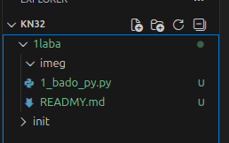
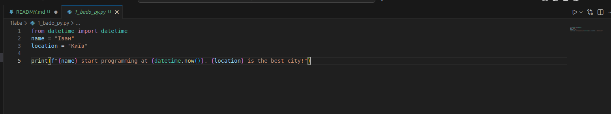

## структура мого репозиторі.

----



----

## Створення Python-файлу (.py)

[тут приклад першого коду](1_bado_py.py)

для йог запуску можна нажати на трикутник з права зверзу 



або ж в терміналі для запоску кодом

```
python3 1_bado_py.py

```
вивела
```
Іван start programming at 2025-12-19 15:50:34.960995. Київ is the best city!
```